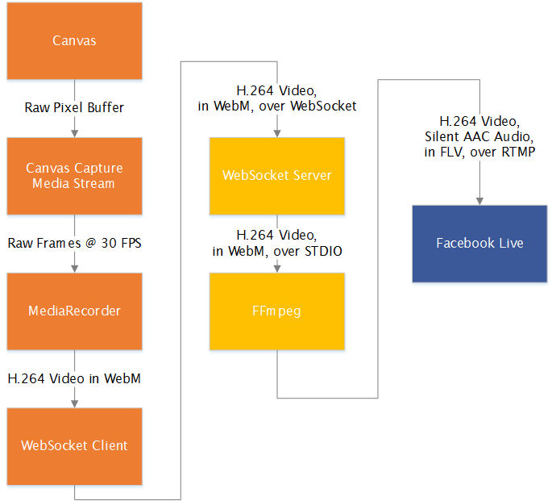
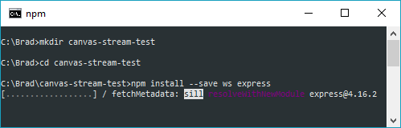
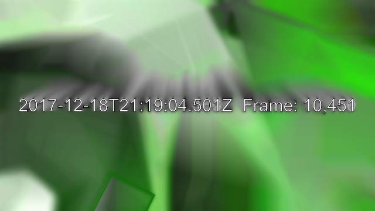
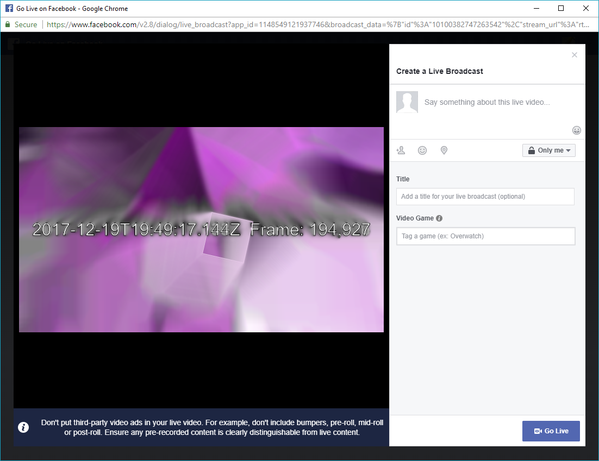

# Streaming to Facebook Live from a `<canvas>`

Facebook provides the [Live API](https://developers.facebook.com/docs/videos/live-video), which allows developers to stream live video content to Facebook from any source that supports an RTMP output.  While typically used with professional hardware and software encoders, it can also be used with web browsers with a little help from a server-side RTMP proxy.

There are two browser technologies required.  [CanvasCaptureMediaStream](https://developer.mozilla.org/en-US/docs/Web/API/CanvasCaptureMediaStream) is used to create a raw video stream from a [canvas](https://developer.mozilla.org/en-US/docs/Web/API/Canvas_API) element.  The [MediaRecorder API](https://developer.mozilla.org/en-US/docs/Web/API/MediaRecorder) is what allows codec usage in the browser, turning raw video into VP8, VP9, or H.264 encoded video which can be efficiently sent to the server.  As of this writing, only Chrome, Firefox, and Opera support these technologies.  Of these browsers, only Chrome supports encoding with the H.264 codec which is the video codec required by Facebook Live.  For Firefox and Opera, the user's video would need to be transcoded server-side.  This extra transcoding step requires a significant amount of CPU resource on the server.

## Architecture

This project is made up of three parts.  The first is the client-side application, shown below in orange, which handles the actual creation of the video stream.  The second part is a proxy, shown in yellow, which translates from WebSocket to RTMP.  The third part is the Facebook Live API itself.



RTMP was a protocol used for server-side interactions with Flash applications.  It was eventually adapted for publishing and distributing video streams.  While still a popular protocol for streaming, no browser supports it natively.  Therefore, to stream video from a browser, we need a transport protocol that is supported by the browser.

[WebSockets](https://developer.mozilla.org/en-US/docs/Web/API/WebSockets_API) are a good choice, as they enable a persistent connection to stream binary data between the client and server.  We can use a WebSocket connection as a pipe through which we send video data.  Once the video data reaches the server, we have more flexibility in technology choice and can relay it to Facebook Live over RTMP, which is the only protocol the Facebook Live API supports.

In addition to lack of browser RTMP support, there are other incompatibilities between browser-recorded video and Facebook Live.  Browsers will typically use [WebM](http://www.webmproject.org/about/) for a container format, but usage of RTMP requires FLV.  Therefore, the audio and video streams must be unwrapped from WebM and re-wrapped with FLV.  Additionally, there are codec compatibility problems.  Browsers typically use [Opus](http://opus-codec.org/) for audio, whereas FLV and RTMP and therefore Facebook Live do not support it.  If audio is sent from the browser, it must be transcoded to AAC.  For video, Google Chrome on most platforms can encode H.264 which is compatible.  For other browsers that do not support H.264, the video will need to be transcoded as well.  This requires significant CPU usage server-side and reduces video quality.

FFmpeg is a tool that can handle the container formats and transcoding, and comes with a built-in RTMP client as well.  Therefore, it is a good tool to use in solving most of our compatibility challenges.  However, FFmpeg does not support WebSockets, so we will write a small wrapper around it to handle this.

## Building the WebSocket-to-RTMP Proxy with Node.js and FFmpeg

For this tutorial, we'll start in the middle of the architecture... the proxy.

Node.js has excellent WebSocket libraries available.  We will write our proxy with Node.js.  If you aren't already familiar with it, consider [installing Node.js](https://nodejs.org/en/download/) and [experimenting](https://nodejs.org/en/docs/guides/) with creating a basic application or two.

Once you have Node.js installed on your system, make a directory for your project and install the relevant NPM modules.  This is typically done from the command line:



```
mkdir canvas-stream-test
cd canvas-stream-test
npm install --save ws express
```

[ws](https://github.com/websockets/ws) is a basic module for handling WebSockets on top of Node.js' built-in HTTP server.

[Express](http://expressjs.com/)is a popular module for routing and handling HTTP requests.  We are using it here as a static file serving utility only.  It is not strictly required for this proxy application and may be removed once you host your streaming page elsewhere.

You will also need to install [FFmpeg](https://ffmpeg.org/).  Be sure to understand any legal requirements for using FFmpeg in your application, as well as licensing restrictions and patents on codecs used.

Once all dependencies are installed, create a new script named server.js or something similar.  We will start by setting up the basic HTTP server and bringing in dependencies:

```js
const child_process = require('child_process'); // To be used later for running FFmpeg
const express = require('express');
const http = require('http');
const WebSocketServer = require('ws').Server;

const app = express();
const server = http.createServer(app).listen(3000, () => {
  console.log('Listening...');
});

// Serve static files out of the www directory, where we will put our HTML page
app.use(express.static(__dirname + '/www'));
```

If you run this application now (run `node server.js`), you should see �Listening...� on the terminal, and if you go to http://localhost:3000/ you should see �Cannot GET /�.  This means that your server was able to listen on port :3000 and is handling HTTP requests, but there is nothing in the `www` directory yet to serve.  If you don't see what is expected, make sure node is in your path, that you don't have a strange firewall configuration blocking port :3000, and that nothing else is listening on port :3000.  (You can change this to any usable port if needed.  The specific port doesn't matter.  :3000 is just an example.)  Stop your Node.js server by pressing Ctrl + C.

Now, we will add a WebSocket server by appending this code to server.js:

```js
const wss = new WebSocketServer({
  server: server
});

wss.on('connection', (ws, req) => {
  ws.on('message', (msg) => {
    console.log('DATA', msg);
  });
});
```

This code registers a WebSocketServer instance (wss) on our existing HTTP server instance (server).  When a new connection is received, our handler will then listen for messages on that WebSocket instance (ws) and log a representation of them to the console.  Later on when we start sending data, the console lines will look like this:

```
DATA <Buffer 5e e5 81 01 23 00 b1 63 00 02 10 10 00 1b ed 66 9c c1 f3 f4 bc 96 fe 73 ef fe 87 fe 33 ff 27 8c 46 21 ee ad de 73 1c 6d 15 6f 79 b3 05 41 a6 d5 65 c0 ... >
DATA <Buffer 6b e9 81 05 6e 00 f1 82 00 03 10 10 00 1c 82 06 3d bf d6 7f 6a fb 13 bf aa ff a6 ff 57 d2 35 f8 1d c0 cd f9 01 ec 5f fd f7 fb 0e 15 0e c6 9d fd 39 d1 ... >
DATA <Buffer 69 8c 81 09 b2 00 31 70 00 05 10 10 00 1c 88 df f3 3c 79 bf 59 3c a1 32 93 f9 29 cc 3b c0 e7 e8 4f fc 5f fb 1f da fe 39 7f dd 2f 71 e6 a0 0f 28 5f 4c ... >
```

To get this data into FFmpeg, we need to execute FFmpeg as a child process.  When we [spawn a child process](https://nodejs.org/api/child_process.html#child_process_child_process_spawn_command_args_options), Node.js exposes three streams:

* [STDIN](https://nodejs.org/api/child_process.html#child_process_child_stdin), for sending data into the child process.  We will write our video data from the browser to FFmpeg's STDIN stream.
* [STDOUT](https://nodejs.org/api/child_process.html#child_process_child_stdout), to receive data from the child process.  As we are using FFmpeg's built-in RTMP client to send data directly to Facebook, STDOUT will be left unused in our project.
* [STDERR](https://nodejs.org/api/child_process.html#child_process_child_stderr), to receive error or status messages from the child process.  We will log data from STDERR to the console so that we can debug the situation and see any useful messages that might come from FFmpeg.

Replace the `connection` event handler that we added above with the following code, which will execute FFmpeg when required:

```js
wss.on('connection', (ws, req) => {
  
  // Ensure that the URL starts with '/rtmp/', and extract the target RTMP URL.
  let match;
  if ( !(match = req.url.match(/^\/rtmp\/(.*)$/)) ) {
    ws.terminate(); // No match, reject the connection.
    return;
  }
  
  const rtmpUrl = decodeURIComponent(match[1]);
  console.log('Target RTMP URL:', rtmpUrl);
  
  // Launch FFmpeg to handle all appropriate transcoding, muxing, and RTMP.
  // If 'ffmpeg' isn't in your path, specify the full path to the ffmpeg binary.
  const ffmpeg = child_process.spawn('ffmpeg', [
    // Facebook requires an audio track, so we create a silent one here.
    // Remove this line, as well as `-shortest`, if you send audio from the browser.
    '-f', 'lavfi', '-i', 'anullsrc',
    
    // FFmpeg will read input video from STDIN
    '-i', '-',
    
    // Because we're using a generated audio source which never ends,
    // specify that we'll stop at end of other input.  Remove this line if you
    // send audio from the browser.
    '-shortest',
    
    // If we're encoding H.264 in-browser, we can set the video codec to 'copy'
    // so that we don't waste any CPU and quality with unnecessary transcoding.
    // If the browser doesn't support H.264, set the video codec to 'libx264'
    // or similar to transcode it to H.264 here on the server.
    '-vcodec', 'copy',
    
    // AAC audio is required for Facebook Live.  No browser currently supports
    // encoding AAC, so we must transcode the audio to AAC here on the server.
    '-acodec', 'aac',
    
    // FLV is the container format used in conjunction with RTMP
    '-f', 'flv',
    
    // The output RTMP URL.
    // For debugging, you could set this to a filename like 'test.flv', and play
    // the resulting file with VLC.  Please also read the security considerations
    // later on in this tutorial.
    rtmpUrl 
  ]);
  
  // If FFmpeg stops for any reason, close the WebSocket connection.
  ffmpeg.on('close', (code, signal) => {
    console.log('FFmpeg child process closed, code ' + code + ', signal ' + signal);
    ws.terminate();
  });
  
  // Handle STDIN pipe errors by logging to the console.
  // These errors most commonly occur when FFmpeg closes and there is still
  // data to write.  If left unhandled, the server will crash.
  ffmpeg.stdin.on('error', (e) => {
    console.log('FFmpeg STDIN Error', e);
  });
  
  // FFmpeg outputs all of its messages to STDERR.  Let's log them to the console.
  ffmpeg.stderr.on('data', (data) => {
    console.log('FFmpeg STDERR:', data.toString());
  });

  // When data comes in from the WebSocket, write it to FFmpeg's STDIN.
  ws.on('message', (msg) => {
    console.log('DATA', msg);
    ffmpeg.stdin.write(msg);
  });
  
  // If the client disconnects, stop FFmpeg.
  ws.on('close', (e) => {
    ffmpeg.kill('SIGINT');
  });
  
});
```

With our FFmpeg-powered WebSocket-to-RTMP proxy complete, we can move on to the client-side portion.

## Setting up a page with a canvas

Let's start by creating a normal HTML page with a canvas element and a 'go live' button.  Name it index.html and place it inside a directory named www under your project.  The server we created previously will use the www directory as its document root.

```HTML
<!doctype html>
<html>
  <head>
    <meta charset="utf-8">
    <script src="https://connect.facebook.net/en_US/sdk.js"></script>
    <script src="js/canvasFill.js"></script>
  </head>
  <body>
    <canvas width="640" height="360"></canvas>
    <nav>
      <button data-action="goLive">Go Live</button>
    </nav>
  </body>
</html>
```

Now, create `www/js/canvasFill.js` with something that draws on the canvas.  As an example, this code draws the current timestamp on top of an abstract background:

```js
(() => {
  let canvas;
  let ctx;
  let frameCount = 0;
  
  let rectState = [0,0,10];
  let rectStateVector = [1,1,1];

  function onFrame() {
    window.requestAnimationFrame(onFrame);
    frameCount ++;
    
    let date = new Date();
    
    // Rotate hue every hour
    let hue = Math.floor(((date.getTime() % (60 * 60 * 1000)) / (60 * 60 * 1000)) * 360);
    
    // Rotate saturation every 5 seconds
    let sat = Math.floor((date.getTime() % 5000)/5000 * 100);
    
    // Rotate luminance every 20 seconds
    let lum = Math.floor((date.getTime() % 20000)/20000 * 100);
    
    // Rotate angle every minute
    let angle = (((date.getTime() % (60 * 1000)) / (60 * 1000)) * 360) * Math.PI / 180;
    
    
    ctx.resetTransform();
    
    ctx.filter = 'blur(1px)';
    ctx.drawImage(canvas, 0.5, 0, canvas.width -1, canvas.height -0.5);
    ctx.filter = 'none';
    ctx.globalAlpha = 1;
    
    
    ctx.fillText(date.toISOString() + '  Frame: ' + frameCount.toLocaleString(), canvas.width/2, canvas.height/2);
    ctx.strokeStyle='#000';
    ctx.strokeText(date.toISOString() + '  Frame: ' + frameCount.toLocaleString(), canvas.width/2, canvas.height/2);
    
    ctx.translate(rectState[0], rectState[1]);
    ctx.rotate(angle);
    ctx.strokeStyle = 'hsl(' + hue + ', ' + sat + '%, ' + lum + '%)';
    ctx.strokeRect(-rectState[2]/2, -rectState[2]/2, rectState[2], rectState[2]);
    if (rectState[0] >= canvas.width) {
      rectStateVector[0] = -1;
    }
    if (rectState[0] <= 0) {
      rectStateVector[0] = 1;
    }
    if (rectState[1] >= canvas.height) {
      rectStateVector[1] = -1;
    }
    if (rectState[1] <=0) {
      rectStateVector[1] = 1;
    }
    if (rectState[2] >= 200) {
      rectStateVector[2] = -1;
    }
    if (rectState[2] <=5) {
      rectStateVector[2] = 1;
    }
    for (let i = 0; i<rectState.length; i++) {
      rectState[i] += rectStateVector[i] * 1;
    }
  }

  document.addEventListener('DOMContentLoaded', (e) => {
    canvas = document.querySelector('canvas');
    ctx = canvas.getContext('2d');
    ctx.font = '30px sans-serif';
    ctx.textAlign = 'center';
    ctx.textBaseline = 'middle';
    ctx.fillStyle = '#fff';
    ctx.fillRect(0, 0, canvas.width, canvas.height);
    onFrame();
  });  
})();
```

Before continuing on, let's test what we have so far.  Start your server (node server.js), and navigate to [http://localhost:3000](http://localhost:3000/).  If all is well, you should see something like this:



## Register a Facebook Application

To use the Graph API to create Facebook Live videos, you first need to register your application, and retrieve its app ID.

1. Register your new app at [https://developers.facebook.com/](https://developers.facebook.com/).
2. Under your app's settings, copy its 'App ID'.  We will use this later.
3. Click 'Add Platform', and choose 'Website' for the platform type.
4. Enter the base URL of the page where you will be testing.  Note that usage of the Facebook JS SDK requires that this be served over an HTTP(S) server.  Simply loading via `file://` will not work.  For this document, I will be using [http://localhost:3000](http://localhost:3000/).  You may use any hostname that works for your server.
5. Click 'Save Changes'.

If you have trouble with these steps, you may want to read the additional [documentation for setting up an app ID on our Facebook for Developers site](https://developers.facebook.com/docs/apps/register).

Now, add a `<script>` tag just before the closing `</head>` tag in your page.  For simplicity, this script element is where we will put all remaining client-side code in this tutorial.  Of course, you can move it to a separate script as you see fit.  In your new script tag, initialize the Facebook SDK:

```js
FB.init({
  appId: 'your app id',
  version: 'v2.8'
});
```

## Create a Facebook Live Video

Before streaming to Facebook Live, we first have to create a live video object and retrieve the RTMP URL to stream to.  The [Facebook Live API](https://developers.facebook.com/docs/videos/live-video/getting-started) can be used directly for this.  Alternatively, the [Go Live Dialog](https://developers.facebook.com/docs/videos/live-video/exploring-live#golivedialog) can be used to create the video, prompting the user for title, description, visibility, and where to post.  For this tutorial, we will use the Go Live Dialog, as it simplifies video creation.

The Go Live Dialog works in two phases.  The 'create' phase allows the user to specify where they want their video to appear on Facebook.


The second phase of the Go Live Dialog, 'publish', allows users to set the title, any relevant tags, and preview the video stream before actually going live on Facebook.



After our SDK initialization code from the previous section, add the following code to launch the Go Live Dialog when our 'go live' button is clicked.

```js
document.addEventListener('DOMContentLoaded', () => {
  document.querySelector('[data-action="goLive"]').addEventListener('click', (e) => {
    FB.ui({
      display: 'popup',
      method: 'live_broadcast',
      phase: 'create'
    }, (createRes) => {
      console.log(createRes);
    });
  });
});
```

In this code snippet, we wait for the page HTML to be parsed and loaded.  Then, we find our 'go live' button and tell the Facebook JS SDK to launch the live creation dialog when the button is clicked.  When the user clicks 'go live', fills out the form for the create phase, and clicks 'next', our callback will be called with the create phase response data in createRes.  On the console, you should see something like this:

```JSON
{
  "id": "12345",
  "secure_stream_url": "rtmps://rtmp-api.facebook.com:443/rtmp/12345?�",
  "stream_url": "rtmp://rtmp-api.facebook.com:80/rtmp/12345?�"
}
```

The two key pieces are the stream_url and the secure_stream_url.  We can stream our video to either of these URLs to get it into the Facebook CDN.  Naturally, secure_stream_url should be your first choice as it uses TLS for encryption.  However, RTMPS URLs do not work with some builds of FFmpeg.  You may have to use stream_url instead.  Experiment and choose the one that works for you.  Other than transport security, the URLs are functionally equivalent.

We must now launch the 'publish' phase dialog.  Within our create dialog callback, right under where we log createRes, add the following code:

```js
FB.ui({
  display: 'popup',
  method: 'live_broadcast',
  phase: 'publish',
  broadcast_data: createRes
}, (publishRes) => {
  console.log(publishRes);
});
```

Note that for this dialog work, you will need to allow pop-ups on your test page.

We don't actually need the data from publishRes for this example.  You can use that data in your own code later to handle errors or user cancellation.  You can read more about returned data from the dialogs in the [Go Live Dialog Documentation](https://developers.facebook.com/docs/videos/live-video/exploring-live#golivedialog).

## Connect to the WebSocket-to-RTMP Proxy

With the Facebook Live video object created, and a target RTMP URL in-hand (from `secure_stream_url` or `stream_url` in the previous step), we can now open a connection to our proxy.  The proxy looks for a path that begins with `/rtmp/`, followed by the target RTMP URL.  For example:

```
ws://localhost:3000/rtmp/rtmp%3A%2F%2Frtmp-api.facebook.com%3A80%2Frtmp%2F12345
```

Note that the target RTMP URL is [encoded](http://www.blooberry.com/indexdot/html/topics/urlencoding.htm), to avoid any ambiguity.

To implement this, add the following code underneath our 'publish' phase dialog setup, but still within the callback for the 'create' phase dialog:

```js
const ws = new WebSocket(
  window.location.protocol.replace('http', 'ws') + '//' + // http: -> ws:, https: -> wss:
  window.location.host + 
  '/rtmp/' + 
  encodeURIComponent(createRes.stream_url)
);

ws.addEventListener('open', (e) => {
  console.log('WebSocket Open', e);
});

ws.addEventListener('close', (e) => {
  console.log('WebSocket Close', e);
});
```

This code creates a new WebSocket connection with a WebSocket URL based on the current protocol (HTTP is switched to WS, HTTPS is switched to WSS), and the current host (which includes port).  From there, it adds event handlers for when a connection is established or disconnected.  If you run the server and open the page, open the developer console, and try to go live, you should see a WebSocket connection open indication on the console output.  If you do not, debug this before proceeding.

## Capturing the canvas with CanvasCaptureStream and MediaRecorder

Before we can send video of the canvas, we first need to run it through a video codec.  The codec takes the raw uncompressed frames and turns them into a compressed video stream, greatly reducing the data required to store and/or transmit the video.  In the browser APIs, codecs are used via a MediaRecorder instance.  MediaRecorder takes a MediaStream, runs it through the codec, and outputs compressed video.  Therefore, to use the MediaRecorder, we also need to get a MediaStream from our canvas.

A MediaStream can be created for a canvas instance like so:

```js
let mediaStream = document.querySelector('canvas').captureStream(30); // 30 FPS
```

Once we have our MediaStream instance, we can create a MediaRecorder instance.  In Chrome, we can request H.264 for the video codec, allowing us to skip transcoding on the server.

```js
let mediaRecorder = new MediaRecorder(mediaStream, {
  mimeType: 'video/webm;codecs=h264',
  videoBitsPerSecond: 3 * 1024 * 1024
});
```

The MediaRecorder fire a `dataavailable` event with regular blobs of data as it encodes the stream.  This is the encoded video, inside of a video container (such as WebM), ready to be written to a file.  We won't be writing it to a file... this is what we will be writing back to our WebSocket to be sent to the proxy to be piped into FFmpeg's STDIN.

Replace your code  for WebSocket open/close events with the following:

```js
let mediaStream;
let mediaRecorder;
ws.addEventListener('open', (e) => {
  console.log('WebSocket Open', e);
  mediaStream = document.querySelector('canvas').captureStream(30); // 30 FPS
  mediaRecorder = new MediaRecorder(mediaStream, {
    mimeType: 'video/webm;codecs=h264',
    videoBitsPerSecond : 3 * 1024 * 1024
  });

  mediaRecorder.addEventListener('dataavailable', (e) => {
    ws.send(e.data);
  });

  mediaRecorder.addEventListener('stop', ws.close.bind(ws));

  mediaRecorder.start(1000); // Start recording, and dump data every second
});

ws.addEventListener('close', (e) => {
  console.log('WebSocket Close', e);
  mediaRecorder.stop();
});
```

That's all there is to it!  Now when you reload the page, you should be able to click 'go live', indicate where you want the stream and what you want to call it, and then see your streams on Facebook within 30 seconds or so.

## Production Use and Operational Concerns

While this tutorial will enable you to stream to Facebook Live, there are some additional steps and items to consider if you wish to use this for an actual product.

### Security

The WebSocket-to-RTMP proxy accepts an arbitrary output URL.  This enables anyone to proxy to an arbitrary RTMP server, but also enables writing streamed files to disk.  This is potentially dangerous.  To use outside of a restricted development environment, you should integrate your site's authentication/authorization to restrict access to the proxy, and white-list URLs to stream to.

Also note that FFmpeg is a complex software package, incorporating many libraries that have [several security vulnerabilities](https://www.cvedetails.com/vulnerability-list/vendor_id-3611/Ffmpeg.html) at any given time.  You should consider jailing the process with chroot and similar.

Use RTMPS when streaming to Facebook Live when possible.  While some builds of FFmpeg do not support RTMPS, it is recommended that you find a build that does to maintain users' privacy.

### Browser Compatibility

As previously mentioned, only Google Chrome currently supports the necessary functionality for recording a canvas as well as the H.264 codec required to avoid the load of transcoding video server-side.  Firefox and Opera can be used if you choose to transcode VP8 to H.264 server-side.  Neither Edge nor Safari support the APIs for capturing a stream from a canvas.

Please also note that CanvasCaptureMediaStream and MediaRecorder are still considered experimental functionality.  The APIs for these features are subject to change.  Test regularly with canary and beta versions of browsers to ensure your code still works when browsers are updated.

### Performance

Encoding video is CPU intensive.  Some browsers may use hardware-accelerated codecs, but most do not.  Experiment with lower resolutions if CPU load becomes an issue.

In the example code, the video bit rate is hard set to 3 Mbps.  Adjust this to an appropriate amount of bandwidth for your content that also enables you to stream from most of your users.  Note that you cannot change the bit rate mid-stream.

## Resources

Specifications

* [W3C: Media Capture from DOM Elements](https://w3c.github.io/mediacapture-fromelement/)
* [W3C: MediaStream Recording](https://www.w3.org/TR/mediastream-recording/)

Developer Documentation

* [MDN: HTMLCanvasElement.captureStream()](https://developer.mozilla.org/en-US/docs/Web/API/HTMLCanvasElement/captureStream)
* [MDN: MediaStream Recording API](https://developer.mozilla.org/en-US/docs/Web/API/MediaStream_Recording_API)
* [MDN: MediaRecorder](https://developer.mozilla.org/en-US/docs/Web/API/MediaRecorder)
* [FFmpeg Documentation](https://ffmpeg.org/ffmpeg.html)
* [FFmpeg Streaming Guide](https://trac.ffmpeg.org/wiki/StreamingGuide)
* [ws Documentation](https://github.com/websockets/ws)
* [Node.js Child Processes](https://nodejs.org/api/child_process.html)

## License
See the license in [LICENSE](LICENSE).